# Taskly Pro

Taskly Pro is a smart, student-focused task management system designed to help you organize daily study goals, track task progress, manage team projects, and stay consistent using streaks and motivational rewards.

## Description

Built by students, for students — Taskly Pro simplifies your academic workload with AI-powered planning, clear task visibility, and group collaboration tools. Whether working solo or in a team, it helps improve productivity and reduce last-minute stress.

## Features

- AI-powered study planner using Cohere API
- Daily scheduling of tasks with in-progress, completed, and deleted views
- Progress tracking with streaks and leaderboard
- Team-based task assignment and file uploads
- Responsive UI with a clean dashboard
- Simple user authentication system (register, login, profile)

## Languages & Technologies Used

- Frontend: HTML, TailwindCSS, JavaScript (basic interactivity)
- Backend: Python (Flask framework)
- Templating: Jinja2
- Database: SQLite
- AI API: Cohere (for study plan generation)
- Environment: Virtualenv
- Others: JSON (for streak data)

## Project Structure

### 🌐 Routes Overview

| Route              | Method | Description                         | Template          |
|-------------------|--------|-------------------------------------|-------------------|
| `/`               | GET    | Home page                           | `index.html`      |
| `/login`          | GET/POST | Login page                        | `login.html`      |
| `/register`       | GET/POST | User registration                  | `register.html`   |
| `/profile`        | GET/POST | User profile info/edit             | `profile.html`    |
| `/tasks`          | GET    | View all tasks                      | `tasks.html`      |
| `/completed`      | GET    | Completed tasks                     | `completed.html`  |
| `/deleted`        | GET    | Deleted tasks                       | `deleted.html`    |
| `/inprogress`     | GET    | In-progress tasks                   | `inprogress.html` |
| `/schedule`       | GET/POST | Task schedule (Pomodoro etc.)     | `schedule.html`   |
| `/study-plan`     | GET/POST | AI-generated study plans          | `study_plan.html` |
| `/teams`          | GET/POST | Manage or join teams              | `teams.html`      |
| `/todo`           | GET/POST | Main to-do app                    | `todo.html`       |

## How to Run the Project

Follow the steps below to run Taskly Pro locally.

### 1. Clone the Repository

```bash
git clone https://github.com/varshitha102/AI_Task_Manager_Taskly_Pro.git
cd taskmanager/taskmanager
```

### 2. Create a Virtual Environment

```bash
python -m venv venv
```

### 3. Activate the Virtual Environment

- On Windows:
  ```bash
  venv\Scripts\activate
  ```
- On macOS/Linux:
  ```bash
  source venv/bin/activate
  ```

### 4. Install Dependencies

```bash
pip install -r requirements.txt
```

### 5. Set Up the API Key

1. Go to https://cohere.com and sign up for a free API key.
2. Create a `.env` file in the project root.
3. Add the following line:

   ```
   COHERE_API_KEY=your_api_key_here
   ```

   Make sure this key is loaded in your code using `os.environ.get()` or the `dotenv` module.

### 6. Run the Application

```bash
python index.py
```

Open your browser and go to: http://127.0.0.1:5000

## License

This project is licensed under the MIT License. See the `LICENSE` file for details.

## Authors

- Keerthi – Backend development, authentication, collaboration features
- Varshitha – Frontend design, AI planner integration, dashboard, streaks, rewards

## Screenshots

- **Login View**: 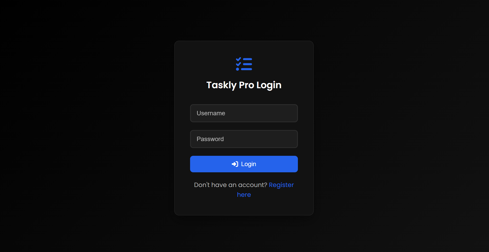
- **Register View**: 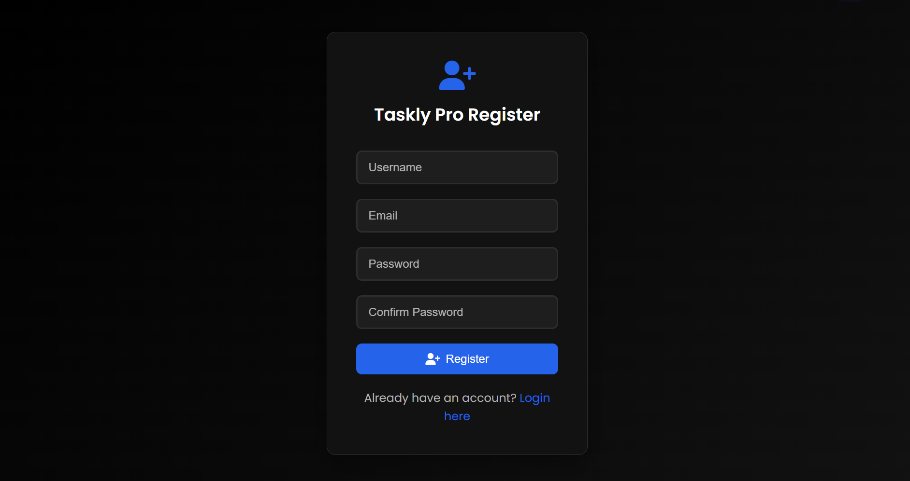
- **Dashboard View**: 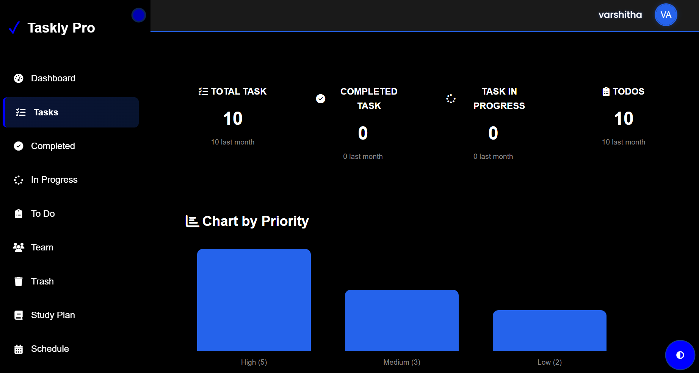 
- **Home View**: 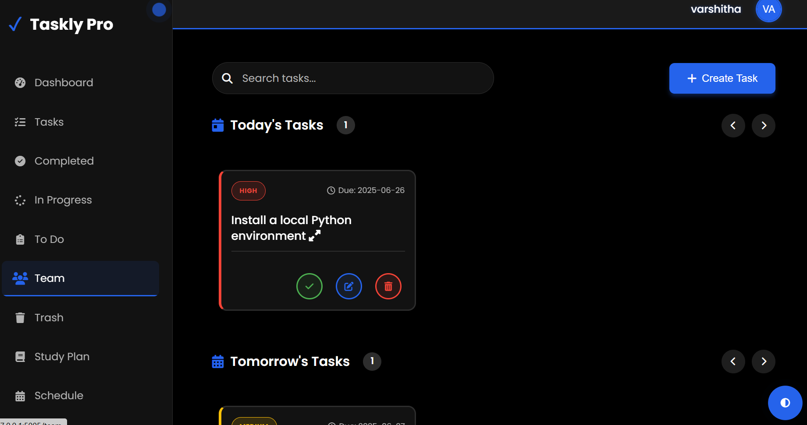
- **Study Plan**: 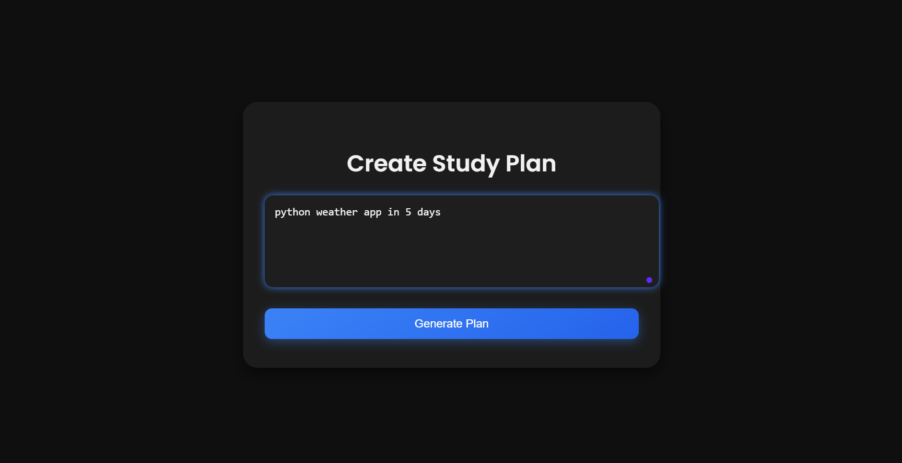
- **Studyplan Task Generation**: 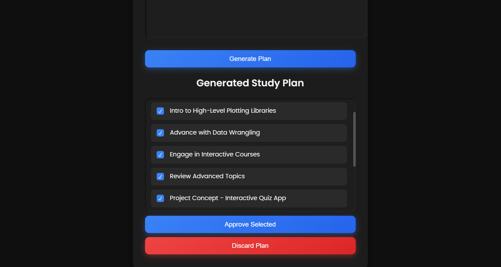
- **Schedule**: 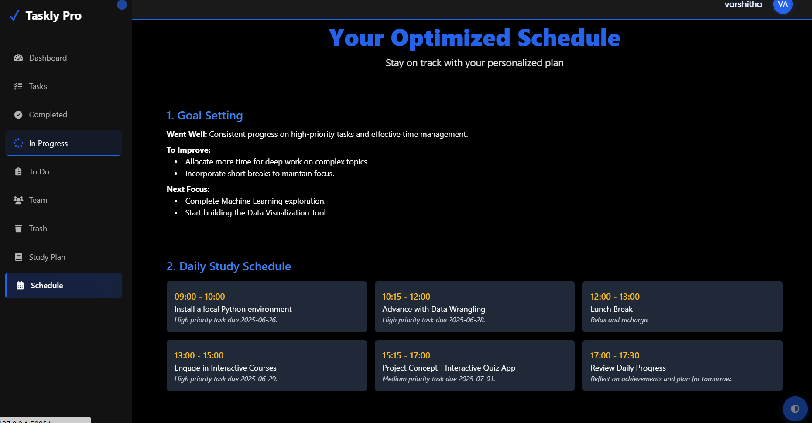
- **Inprogress tasks View**: 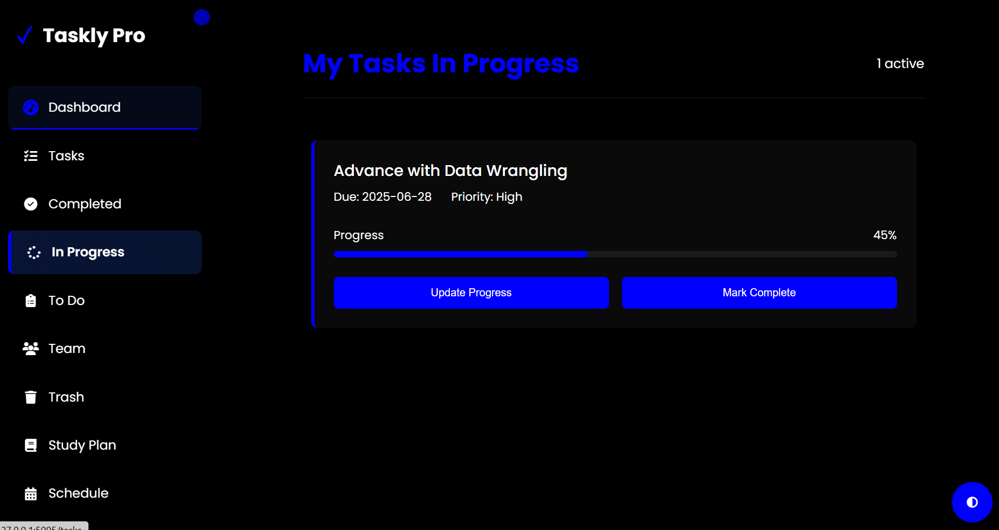
- **Completed tasks View**: 
- **Deleted tasks View**: 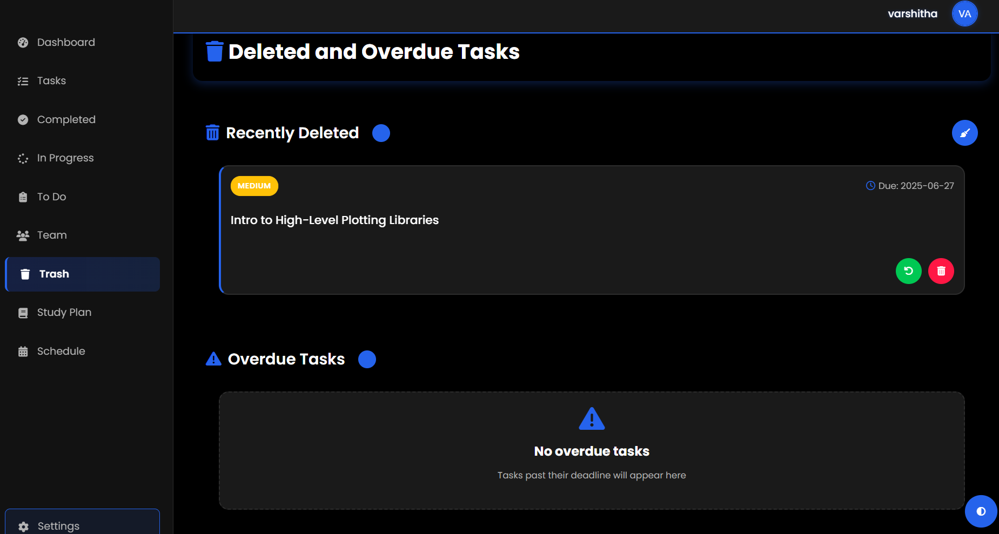
- **Todo View**: 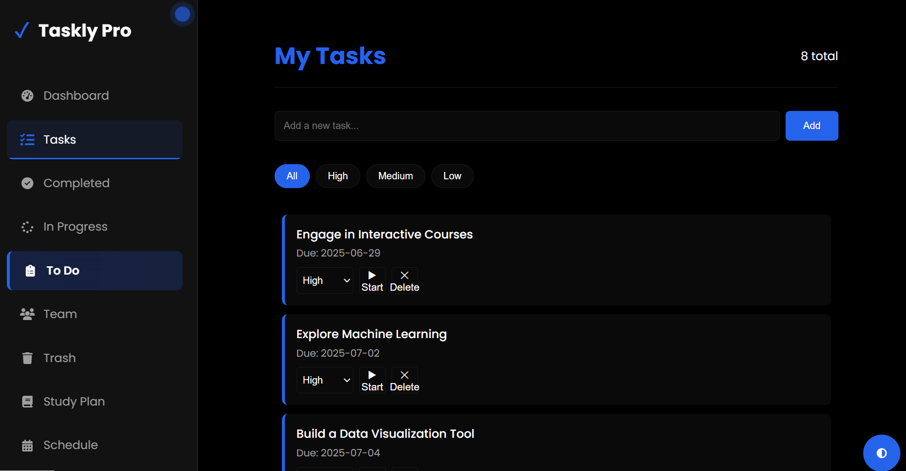
- **Teams**: 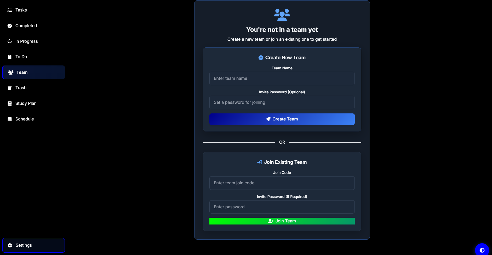
- **Members**: 
- 
